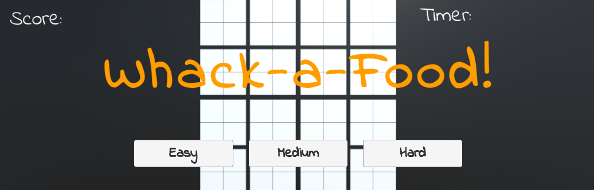
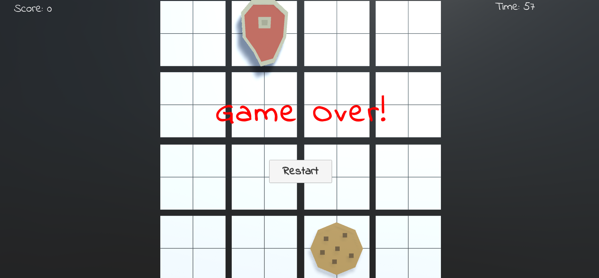

# 🍽️ Whack-a-Food – Unity UI & Click Challenge

This Unity project challenges your user interface (UI) skills in a **whack-a-mole-style** gameplay experience. The goal is to click on food items that pop up on a grid to earn points — but be careful not to click on skulls! All UI interactions, difficulty selection, score tracking, and restart systems should function flawlessly.

---

## 📸 Screenshots

### 🎮 Game View:

---

## 🎯 Challenge Overview

Your objectives in this project are:

- All buttons are neatly aligned, with correctly centered text labels
- Selecting a difficulty changes how fast the food spawns
- Clicking on food: the food disappears and the score increases
- When the game is lost, a restart button appears and is clickable
- You must identify and fix several bugs to ensure all systems work properly

---

## ✅ Challenge Outcome

- ✅ **UI buttons are properly aligned** and text is legible
- 🧠 **Difficulty selection** affects spawn rate (`Easy`, `Medium`, `Hard`)
- 🍕 **Clicking on food destroys it**, increases score, and displays it on screen
- 💀 **Clicking a skull ends the game**
- 🔁 **"Restart" button** resets the game

---

## 🧩 Technical Features

| Feature                     | Description                                                                 |
|-----------------------------|-----------------------------------------------------------------------------|
| **Canvas & Anchors**        | Ensures UI elements stay in place across different resolutions              |
| **Buttons**                 | Used for starting the game, selecting difficulty, and restarting            |
| **OnClick() Events**        | Triggers game actions via mouse clicks                                     |
| **TextMeshPro**             | Displays the score clearly in the top corner                               |
| **GameObject.SetActive()**  | Toggles the visibility of the restart screen                               |
| **Spawn Manager**           | Randomly spawns food at intervals in different positions                    |
| **Custom Methods with Params** | Sets spawn speed based on the selected difficulty level                |
| **SceneManager.LoadScene()**| Reloads the scene when the game is restarted                               |

---

## 🗂️ Project Folder Structure
